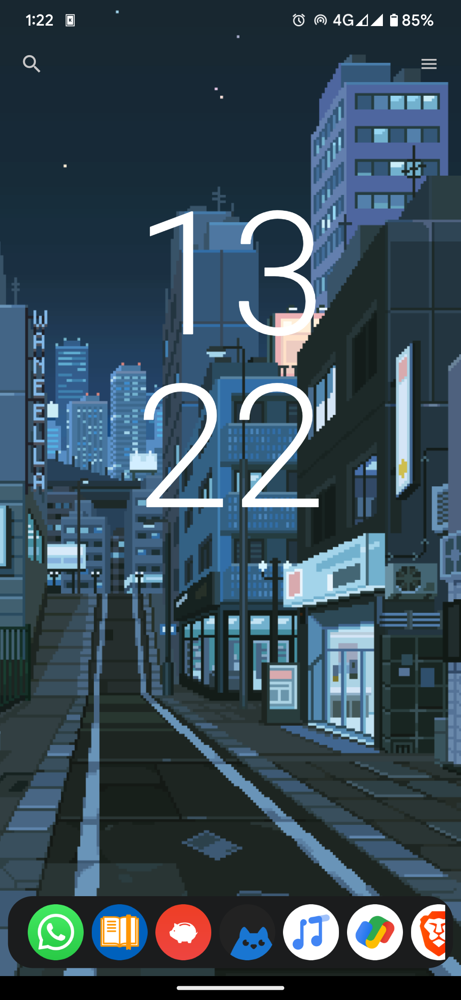
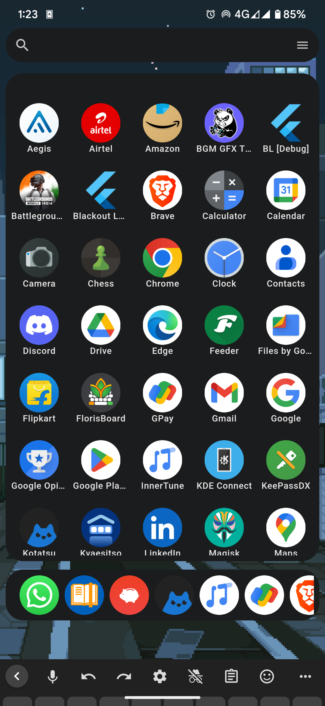
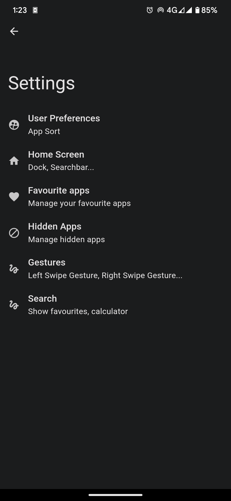
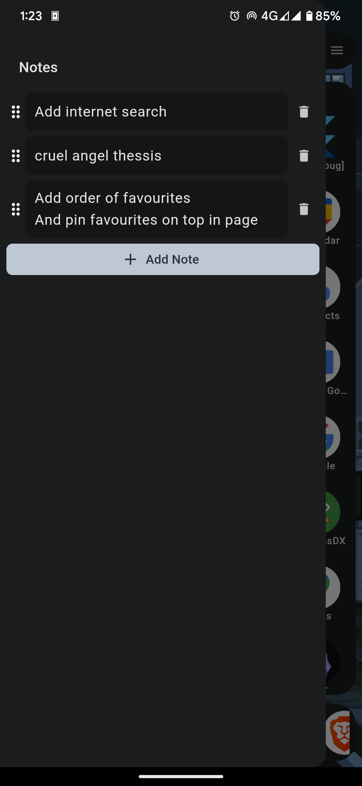

# Blackout Launcher

A search based home screen launcher made using Flutter.

## Images

     

## Features

- Search Bar for searching application.
- Calculator in search bar.
- Side-wise scrollable Dock with favourite application.
- Customizations for dock and search bar.
- A built-in notepad in side drawer.
- Various customization settings.

## Features to be implemented

- Home screen widget support.
- More built-in widgets like step-counter.
- More gesture controls.
- More customization settings.
- Wikipedia search support through search bar.

## License

This project is licensed under the GNU GPL3. See the [LICENSE](LICENSE) file for details.
